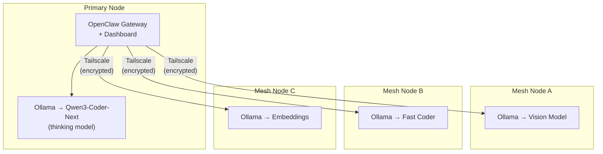
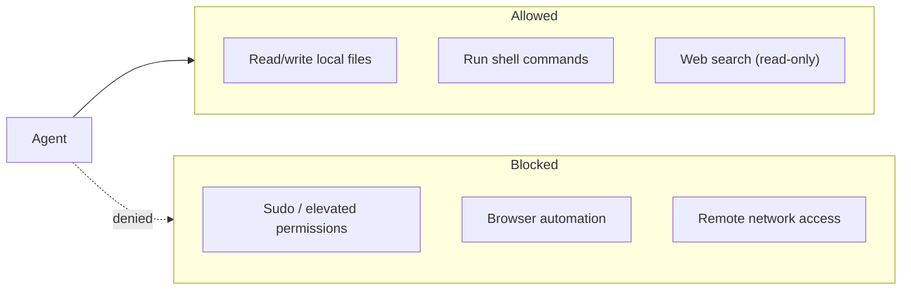

# Tritium Coder

**Local AI coding stack for NVIDIA hardware with 128 GB+ unified memory.**

Run AI coding agents on your own hardware — no cloud, no API keys, no data leaves your network.

> **Target hardware:** NVIDIA GB10 (128 GB), Jetson AGX Thor, or multi-GPU workstations.
> **Not enough GPU?** Use [remote mode over Tailscale](#remote-setup) — run inference on a GPU server, everything else locally.

*By Matthew Valancy | Valpatel Software | (c) 2026*

---

### Requirements

| Resource | Minimum | Recommended |
|----------|---------|-------------|
| **GPU Memory** | 32 GB VRAM or unified | 128 GB+ unified |
| **RAM** | 16 GB | 64 GB+ |
| **Disk** | 80 GB free | 200 GB+ |
| **OS** | Linux (aarch64 or x86_64) | Ubuntu 24.04+ |

### Will My Hardware Work?

| Hardware | GPU Memory | Verdict |
|----------|------------|---------|
| **NVIDIA GB10** | 128 GB unified | Best — runs the full stack |
| **Jetson AGX Thor** | 128 GB unified | Excellent |
| **RTX 5090 x2** | 64 GB VRAM | Good — fits with quantization |
| **RTX 4090** | 24 GB VRAM | Mesh node only, or use `QUANT=UD-TQ1_0` |
| **RTX 3060 6 GB** | 6 GB VRAM | Will not work — use [remote mode](#remote-setup) |
| **No NVIDIA GPU** | 0 | Remote mode only |
| **8 GB laptop** | 0 | Will not work — use [remote mode](#remote-setup) |

### Tested Hardware

| Device | RAM | Price | Fit |
|--------|-----|-------|-----|
| **NVIDIA GB10** | 128 GB unified | ~$3,000 | Best value |
| **Jetson AGX Thor** | 128 GB unified | ~$5,000+ | Excellent |
| **RTX 5090 x2 workstation** | 128 GB+ | $8,000+ | Great |
| **Mac Studio M4 Ultra** | 192 GB unified | ~$8,000 | Use MLX quants |

---

## What Is This?

Tritium Coder turns local hardware into an AI coding workstation — and scales it into an agent mesh across multiple machines. One script downloads a state-of-the-art model, wires it into professional coding tools with a web dashboard, and gets out of your way.

**Three ways to interact:**

1. **Dashboard** — Web UI for chat, job management, exec approvals, and config (`openclaw dashboard`)
2. **Terminal agent** — Interactive CLI that reads, writes, runs, and debugs code (`scripts/run-openclaw.sh`)
3. **Claude Code** — Drop-in local replacement for Claude (`scripts/run-claude.sh`)

**Current default stack (every piece is swappable):**

| Layer | Current Default | Swap With |
|-------|----------------|-----------|
| **Language Model** | [Qwen3-Coder-Next](https://ollama.com/library/qwen3-coder-next) (80B MoE) | Any Ollama model with tool calling |
| **Model Server** | [Ollama](https://ollama.com) | vLLM, SGLang, llama.cpp, LM Studio |
| **Agent + Dashboard** | [OpenClaw](https://github.com/openclaw/openclaw) | Any OpenAI-compatible client |
| **Coding Agent** | [Claude Code](https://github.com/anthropics/claude-code) | Aider, Continue, Cursor, Cline |
| **API Bridge** | [claude-code-proxy](https://github.com/fuergaosi233/claude-code-proxy) | LiteLLM, claude-adapter |

## Quick Start

```bash
git clone https://github.com/mvalancy/tritium-coder.git
cd tritium-coder
./install.sh
```

The installer handles everything: system deps, model download (~50 GB), proxy setup, OpenClaw + dashboard build.

### After install:

```bash
./start                         # Start the full stack
./dashboard                     # Open control panel (service status, quick actions)
openclaw dashboard              # Open OpenClaw chat dashboard
scripts/run-openclaw.sh         # Launch terminal agent
scripts/run-claude.sh           # Launch Claude Code (local)
./stop                          # Stop and free memory
./status                        # Check what's running
./test                          # Run test suite
```

## Remote Setup

If your local machine doesn't have enough GPU memory, you can offload model inference to a remote GPU server over Tailscale. Everything else (proxy, gateway, dashboard) runs locally.

### On the remote GPU machine:

```bash
# Install Ollama and pull the model
curl -fsSL https://ollama.com/install.sh | sh
ollama pull qwen3-coder-next

# Install Tailscale (if not already)
curl -fsSL https://tailscale.com/install.sh | sh
tailscale up

# Make Ollama listen on all interfaces (for Tailscale access)
# Edit /etc/systemd/system/ollama.service or set:
OLLAMA_HOST=0.0.0.0 ollama serve
```

### On your local machine:

```bash
# Replace 100.x.x.x with your remote machine's Tailscale IP
OLLAMA_HOST=http://100.x.x.x:11434 ./install.sh --remote
./start
```

This skips the ~50 GB model download. The proxy and gateway run locally — only inference calls go over the Tailscale network (encrypted, peer-to-peer).

## Architecture


### Agent Mesh (multi-node)

Add machines to your Tailscale network — each runs Ollama with a specialized model.



See [docs/architecture.md](docs/architecture.md) for detailed diagrams and request flow.
See [docs/mesh.md](docs/mesh.md) for multi-node setup instructions.

## Why Qwen3-Coder-Next?

The default model was chosen because **it actually works as a coding agent.** Tool calling through Ollama means it can read files, edit code, run commands, and debug — the full agentic loop.

| Model | Size | Tool Calling | Agent Mode | Speed |
|-------|------|-------------|------------|-------|
| **Qwen3-Coder-Next** (default) | ~50 GB | Yes | Full agent | Fast (3B active MoE) |
| Devstral-2 123B | ~75 GB | Yes | Full agent | Slower (dense) |
| GPT-OSS 120B | ~65 GB | Yes | Full agent | Fast (5.1B active MoE) |
| MiniMax-M2.5 229B | ~56 GB | No | Chat only | Slow |

To swap: edit `OLLAMA_MODEL_NAME` in `scripts/lib/common.sh` and `.proxy/.env`.

## Security



- **Localhost-only gateway** — not exposed on the network
- **Token auth** — all gateway access requires authentication
- **Full exec** — agent can run commands freely (no sudo, no elevated)
- **No browser / no remote access**
- **Web search** — enabled for research, read-only

See [docs/security.md](docs/security.md) for full details.

## Build System — Perpetual Iteration Engine

Tritium Coder includes an autonomous build system that generates, validates, and iteratively improves any project using the local AI stack. Give it a text description, walk away, and come back to a polished result.

The vision: **perpetual motion**. AI builds code, automated tests verify it actually works from a user's perspective, failures drive the next iteration, and the system self-improves — indefinitely, within time limits you set. No human in the loop required.

```bash
./iterate "Build a Tetris game with HTML5 canvas" --hours 4
```

### How It Works

The engine runs in a loop: **build → health check → fix → improve → test → repeat** — driven by real signals, not a fixed schedule.

**Health Check System** — Every cycle, playwright loads the app in a headless browser and answers: Does it load? Does it render? Does it respond to input? Does it survive 10 seconds? How many JS console errors? The result (PASS/WARN/FAIL) drives what happens next.

**Dynamic Phase Selection** — Instead of a fixed rotation, the engine picks the most useful phase based on health status, file sizes, and project maturity:
- App broken → fix (always, no exceptions)
- Files too large (>1500 lines) → refactor into modules
- App works + early maturity → features
- App works + late maturity → consolidate, polish, docs

**Available Phases:** fix, improve, features, test, runtests, polish, refactor, consolidate, docs

**Zero-Trust Validation** — The system never trusts that code works just because the AI said so. Every prompt emphasizes user-perspective validation: "Would a real person have a good experience?" Tests are written as category nets (rendering failures, state corruption, dead input) not individual bug checks.

**Vision Gate** — After polish/test phases, screenshots at 5 resolutions (desktop, tablet, mobile, ultrawide) are reviewed by a vision model for layout bugs, rendering issues, and UX problems.

**Per-Project Output:**
```
examples/tetris/
  index.html           # The app
  *.js, *.css           # Source files
  test.html             # Test suite (uses lib/test-harness.js)
  README.md             # Auto-generated docs with screenshots
  screenshots/          # Captured at multiple resolutions
  docs/                 # Architecture notes
```

### Batch Mode

```bash
scripts/create-examples.sh        # Build all example projects (tetris, pong, smashtv)
scripts/create-examples.sh 2      # 2 hours per project instead of 4
```

Edit `scripts/create-examples.sh` to add your own project descriptions.

## File Structure

```
tritium-coder/
  install.sh              # One-click installer
  start, stop, status     # Top-level commands
  test                    # Run test suite
  iterate                 # Build/iterate on any project (wraps build-project.sh)
  dashboard               # Open control panel
  CLAUDE.md               # Project context for Claude Code
  README.md               # This file
  LICENSE                 # MIT
  scripts/
    start.sh              # Start the full stack
    stop.sh               # Stop and free memory
    status.sh             # Check what's running
    run-claude.sh         # Launch Claude Code
    run-openclaw.sh       # Launch OpenClaw agent
    build-project.sh      # Core iteration engine (health checks, dynamic phases, vision gate)
    create-examples.sh    # Batch builder for example projects
    lib/
      common.sh           # Shared bash library
  lib/
    test-harness.js       # Shared browser test framework (TritiumTest class)
  config/
    openclaw.json         # Hardened OpenClaw config
  web/
    index.html            # Control panel (service status, model info, quick actions)
  examples/               # Generated projects (gitignored — built by create-examples.sh)
  tests/
    run-all.sh            # Test suite (Tetris, Pong, Smash TV, etc.)
  docs/
    usage.md              # Detailed workflows and examples
    architecture.md       # System architecture diagrams
    security.md           # Security model
    mesh.md               # Multi-node setup guide
```

## Testing

Run the built-in test suite to validate the full stack:

```bash
./test              # Run all tests (todo app, REST API, Tetris, Pong, Smash TV)
./test tetris       # Run one test
./test pong         # Run one test
```

Each test sends a real coding job to the agent, waits for output, and validates the generated code.

## Troubleshooting

| Problem | Fix |
|---------|-----|
| Slow responses | Close other memory-heavy apps. Qwen3-Coder-Next is 80B MoE (3B active), so it's fast. |
| Dashboard "secure context" error | Access via `http://localhost:18789` (chat) or `:18790` (panel), not an IP. For remote: `tailscale serve 18789` |
| Control panel blank | Run `./dashboard` — serves on `http://localhost:18790` |
| Proxy won't start | `./stop && ./start` |
| Node < 22 | `curl -fsSL https://deb.nodesource.com/setup_22.x \| sudo -E bash - && sudo apt install -y nodejs` |
| Download interrupted | Re-run `./install.sh` — resumes automatically |

**Logs:**
```bash
tail -f logs/ollama.log               # Ollama
tail -f logs/proxy.log                # Proxy
tail -f logs/openclaw-gateway.log     # Gateway
openclaw logs --follow                # Agent
```

## Documentation

| Doc | Contents |
|-----|----------|
| [docs/usage.md](docs/usage.md) | Workflows, examples, tips |
| [docs/architecture.md](docs/architecture.md) | System diagrams, request flow |
| [docs/security.md](docs/security.md) | Security model, exec approvals |
| [docs/mesh.md](docs/mesh.md) | Multi-node Tailscale setup |

## Credits

- [Qwen3-Coder-Next](https://ollama.com/library/qwen3-coder-next) by Alibaba/Qwen
- [Ollama](https://ollama.com)
- [Claude Code](https://github.com/anthropics/claude-code) by Anthropic
- [OpenClaw](https://github.com/openclaw/openclaw)
- [claude-code-proxy](https://github.com/fuergaosi233/claude-code-proxy) by fuergaosi233

## License

MIT License. See [LICENSE](LICENSE).
