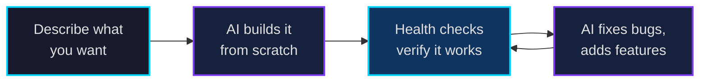
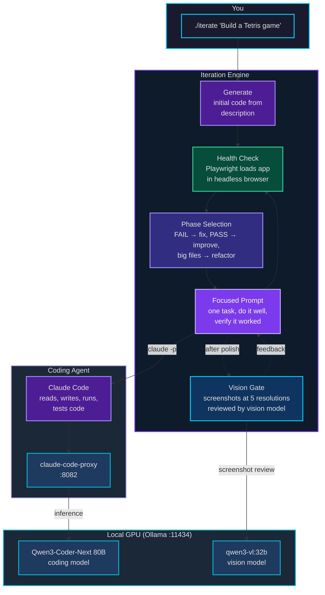
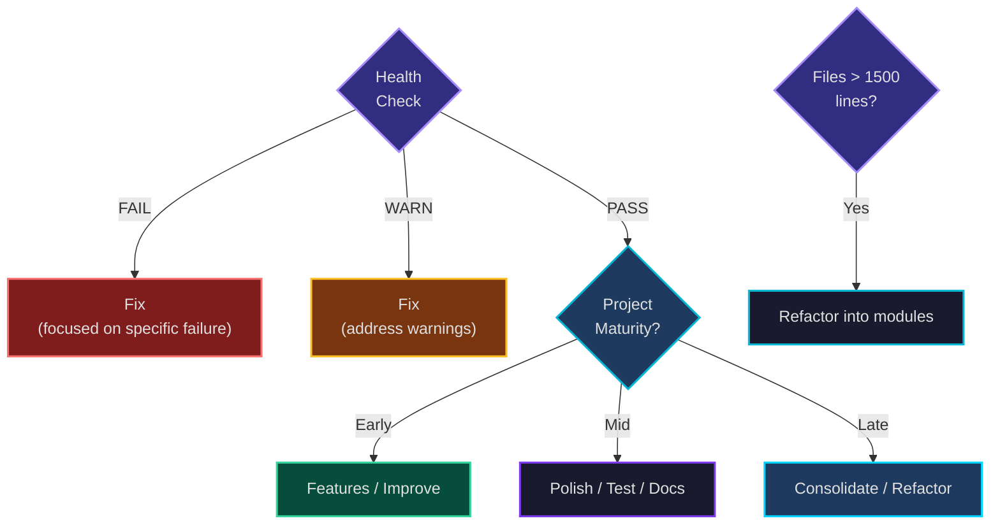

# Tritium Coder

**AI that builds AI — running entirely on your own hardware.**

Give it a text description. Walk away. Come back to a working, tested, documented project — built, validated, and iteratively improved by AI agents running on your local GPU. No cloud. No API keys. No data leaves your machine.

*By Matthew Valancy | Valpatel Software | (c) 2026*

> **On OpenClaw:** We started with OpenClaw as our agent framework. It had good ideas — session persistence, audit trails, security policies, multi-agent coordination. But it's OpenAI now, so it's dead in the water for us. We took the best architectural patterns and rebuilt them natively on Anthropic's Claude Code with offline models via Ollama. No cloud APIs, no phone-home, no OpenAI affiliation. See [docs/roadmap.md](docs/roadmap.md) for where we're headed.

---

## The Vision: Perpetual Motion



The loop runs for as long as you let it. Each cycle:

1. **Health check** — Does the app actually load? Render? Respond to input? Survive without crashing? (Not "does the code look right" — actually load it in a browser and check.)
2. **Decide what to do** — Broken? Fix it. Working? Improve it. Files too big? Refactor. Tests failing? Debug.
3. **Do one thing well** — Focused prompt, single task, verify it worked.
4. **Repeat** — Until the time budget runs out or the project is solid.

The system trusts nothing. Every claim the AI makes about its own code is verified from a real user's perspective — headless browser, screenshots at multiple resolutions, automated test suites that catch categories of bugs, and a vision model that reviews the UI like a brutal QA tester.

```bash
./iterate "Build a Tetris game with HTML5 canvas" --hours 4
```

That's it. One command. The AI handles everything: initial implementation, bug fixing, feature development, visual polish, test writing, documentation, and screenshots.

---

## Hardware Requirements

> **This project requires serious GPU hardware.** The default model is 50 GB. You need 128 GB of unified or GPU memory to run the full stack comfortably. This has been developed and tested on a single NVIDIA GB10.

| Resource | Required |
|----------|----------|
| **GPU Memory** | 128 GB unified (NVIDIA GB10) |
| **Disk** | 80 GB free (model download) |
| **OS** | Linux (Ubuntu 24.04 tested) |

**Tested on:** NVIDIA GB10 (128 GB unified memory, ~$3,000). Other hardware may work but has not been tested.

---

## How It Works



**The stack** (every piece is swappable):

| Layer | Default | Purpose |
|-------|---------|---------|
| **Coding Agent** | [Claude Code](https://github.com/anthropics/claude-code) | Reads, writes, runs, tests code |
| **Language Model** | [Qwen3-Coder-Next](https://ollama.com/library/qwen3-coder-next) 80B MoE | Code generation, reasoning |
| **Model Server** | [Ollama](https://ollama.com) | Runs the model on your GPU |
| **API Bridge** | [claude-code-proxy](https://github.com/fuergaosi233/claude-code-proxy) | Translates Anthropic API → OpenAI API for Ollama |
| **Orchestrator** | build-project.sh | Iteration loop, health checks, phase selection |
| **Health Check** | [Playwright](https://playwright.dev) | Headless browser verification |

---

## Quick Start

```bash
git clone https://github.com/mvalancy/tritium-coder.git
cd tritium-coder
./install.sh          # Downloads model (~50 GB), sets up everything
./start               # Start the local AI stack
```

### Build a project from a description

```bash
./iterate "Build a Tetris game with HTML5 canvas, neon theme, sound effects" --hours 4
```

### Resume and refine

```bash
./iterate "Add multiplayer and a leaderboard" --resume tetris --hours 2
```

### Interactive coding session

```bash
scripts/run-claude.sh           # Claude Code (interactive)
```

### Other commands

```bash
./stop                          # Stop and free GPU memory
./status                        # Check what's running
./test                          # Run test suite
./dashboard                     # Open control panel (localhost:18790)
```

---

## What Gets Built

Every project the system creates maintains its own documentation and test suite:

```
examples/tetris/
  index.html             # The app (open in a browser)
  *.js, *.css             # Source code (refactored into modules)
  test.html               # Automated test suite
  README.md               # Features, controls, screenshots
  screenshots/            # Multi-resolution captures
  docs/                   # Architecture notes
```

### Batch mode

```bash
scripts/create-examples.sh      # Build tetris, pong, smashtv — 4 hours each
```

Edit `scripts/create-examples.sh` to define your own projects.

---

## Zero-Trust Validation

The system assumes every line of AI-generated code is broken until proven otherwise.

**Health checks** load the app in a headless browser every cycle — not "does the code look right" but "does a real user see something, can they interact with it, does it crash?"

**Tests as nets** — Each test catches a *category* of bugs (rendering failures, state corruption, dead input), not individual issues.

**Vision gate** — After improvement phases, screenshots at 5 resolutions (desktop, tablet, mobile, ultrawide) are reviewed by a vision model acting as a brutal QA tester.

**Dynamic phases** — The system picks what to work on based on signals, not a fixed schedule:



---

## Documentation

| Doc | What's in it |
|-----|-------------|
| **[docs/roadmap.md](docs/roadmap.md)** | Vision and roadmap — universal project types, infrastructure, multi-agent |
| **[docs/usage.md](docs/usage.md)** | All workflows — Claude Code, Ollama API, iteration engine |
| **[docs/architecture.md](docs/architecture.md)** | System architecture, request flow, component diagrams |
| **[docs/security.md](docs/security.md)** | Security model — what the agent can and cannot do |
| **[docs/mesh.md](docs/mesh.md)** | Multi-node setup (experimental) |

---

## Project Structure

```
tritium-coder/
  install.sh                # One-click installer
  start, stop, status       # Stack management
  iterate                   # Build any project from a description
  dashboard                 # Control panel (localhost:18790)
  test                      # Run test suite
  scripts/
    build-project.sh        # Core iteration engine
    create-examples.sh      # Batch project builder
    start.sh, stop.sh       # Stack lifecycle
    run-claude.sh           # Claude Code launcher
    lib/common.sh           # Shared bash library
  lib/
    test-harness.js         # Browser test framework (TritiumTest)
  web/
    index.html              # Control panel UI
  docs/                     # Detailed documentation
  examples/                 # Generated projects (gitignored)
```

---

## Credits

- [Claude Code](https://github.com/anthropics/claude-code) by Anthropic
- [Qwen3-Coder-Next](https://ollama.com/library/qwen3-coder-next) by Alibaba/Qwen
- [Ollama](https://ollama.com)
- [Playwright](https://playwright.dev) by Microsoft
- [claude-code-proxy](https://github.com/fuergaosi233/claude-code-proxy) by fuergaosi233

## License

MIT License. See [LICENSE](LICENSE).
