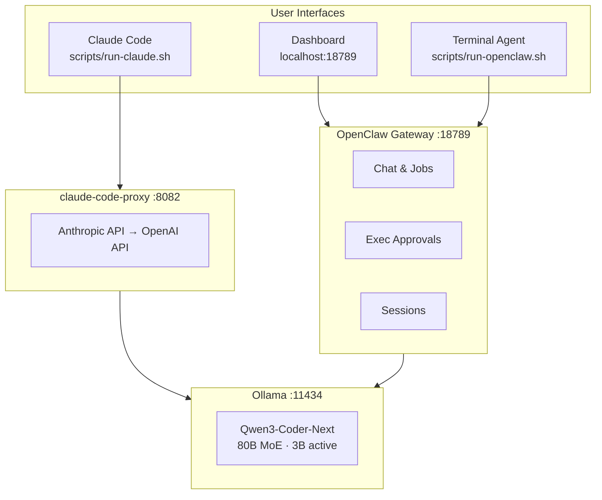
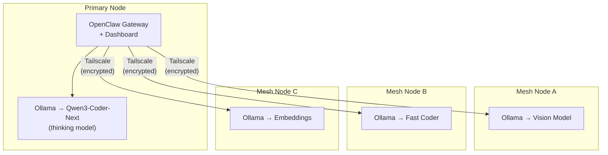
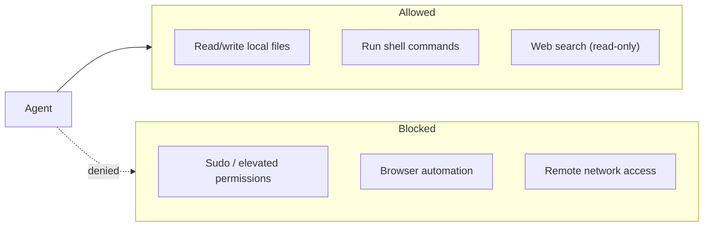

# Tritium Coder

**Dead simple local AI coding stack. One install. One command. Scale across your hardware mesh.**

Run AI coding agents on your own hardware — one machine or a fleet. No cloud. No API keys. No data leaves your network.

*By Matthew Valancy | Valpatel Software | (c) 2026*

---

## What Is This?

Tritium Coder turns local hardware into an AI coding workstation — and scales it into an agent mesh across multiple machines. One script downloads a state-of-the-art model, wires it into professional coding tools with a web dashboard, and gets out of your way.

**Three ways to interact:**

1. **Dashboard** — Web UI for chat, job management, exec approvals, and config (`openclaw dashboard`)
2. **Terminal agent** — Interactive CLI that reads, writes, runs, and debugs code (`scripts/run-openclaw.sh`)
3. **Claude Code** — Drop-in local replacement for Claude (`scripts/run-claude.sh`)

**Current default stack (every piece is swappable):**

| Layer | Current Default | Swap With |
|-------|----------------|-----------|
| **Language Model** | [Qwen3-Coder-Next](https://ollama.com/library/qwen3-coder-next) (80B MoE) | Any Ollama model with tool calling |
| **Model Server** | [Ollama](https://ollama.com) | vLLM, SGLang, llama.cpp, LM Studio |
| **Agent + Dashboard** | [OpenClaw](https://github.com/openclaw/openclaw) | Any OpenAI-compatible client |
| **Coding Agent** | [Claude Code](https://github.com/anthropics/claude-code) | Aider, Continue, Cursor, Cline |
| **API Bridge** | [claude-code-proxy](https://github.com/fuergaosi233/claude-code-proxy) | LiteLLM, claude-adapter |

## Quick Start

```bash
git clone https://github.com/mvalancy/tritium-coder.git
cd tritium-coder
./install.sh
```

The installer handles everything: system deps, model download (~50 GB), proxy setup, OpenClaw + dashboard build.

### After install:

```bash
./start                         # Start the full stack
./dashboard                     # Open control panel (service status, quick actions)
openclaw dashboard              # Open OpenClaw chat dashboard
scripts/run-openclaw.sh         # Launch terminal agent
scripts/run-claude.sh           # Launch Claude Code (local)
./stop                          # Stop and free memory
./status                        # Check what's running
./test                          # Run test suite
```

## Architecture



### Agent Mesh (multi-node)

Add machines to your Tailscale network — each runs Ollama with a specialized model.



See [docs/architecture.md](docs/architecture.md) for detailed diagrams and request flow.
See [docs/mesh.md](docs/mesh.md) for multi-node setup instructions.

## Why Qwen3-Coder-Next?

The default model was chosen because **it actually works as a coding agent.** Tool calling through Ollama means it can read files, edit code, run commands, and debug — the full agentic loop.

| Model | Size | Tool Calling | Agent Mode | Speed |
|-------|------|-------------|------------|-------|
| **Qwen3-Coder-Next** (default) | ~50 GB | Yes | Full agent | Fast (3B active MoE) |
| Devstral-2 123B | ~75 GB | Yes | Full agent | Slower (dense) |
| GPT-OSS 120B | ~65 GB | Yes | Full agent | Fast (5.1B active MoE) |
| MiniMax-M2.5 229B | ~56 GB | No | Chat only | Slow |

To swap: edit `OLLAMA_MODEL_NAME` in `scripts/lib/common.sh` and `.proxy/.env`.

## Security



- **Localhost-only gateway** — not exposed on the network
- **Token auth** — all gateway access requires authentication
- **Full exec** — agent can run commands freely (no sudo, no elevated)
- **No browser / no remote access**
- **Web search** — enabled for research, read-only

See [docs/security.md](docs/security.md) for full details.

## File Structure

```
tritium-coder/
  install.sh              # One-click installer
  start, stop, status     # Top-level commands
  test                    # Run test suite
  dashboard               # Open control panel
  CLAUDE.md               # Project context for Claude Code
  README.md               # This file
  LICENSE                 # MIT
  scripts/
    start.sh              # Start the full stack
    stop.sh               # Stop and free memory
    status.sh             # Check what's running
    run-claude.sh         # Launch Claude Code
    run-openclaw.sh       # Launch OpenClaw agent
    lib/
      common.sh           # Shared bash library
  config/
    openclaw.json         # Hardened OpenClaw config
  web/
    index.html            # Control panel (service status, model info, quick actions)
  tests/
    run-all.sh            # Test suite (Tetris, Pong, Smash TV, etc.)
  docs/
    usage.md              # Detailed workflows and examples
    architecture.md       # System architecture diagrams
    security.md           # Security model
    mesh.md               # Multi-node setup guide
```

## System Requirements

| Component | Minimum | Recommended |
|-----------|---------|-------------|
| RAM | 96 GB unified/shared | 128 GB+ |
| GPU | NVIDIA 8 GB+ VRAM | NVIDIA unified memory (GB10, Jetson) |
| Disk | 120 GB free | 200 GB+ |
| OS | Linux (aarch64 or x86_64) | Ubuntu 24.04+ |

### Tested Hardware

| Device | RAM | Price | Fit |
|--------|-----|-------|-----|
| **NVIDIA GB10** | 128 GB unified | ~$3,000 | Best value |
| **Jetson AGX Thor** | 128 GB unified | ~$5,000+ | Excellent |
| **RTX 5090 x2 workstation** | 128 GB+ | $8,000+ | Great |
| **Mac Studio M4 Ultra** | 192 GB unified | ~$8,000 | Use MLX quants |

## Testing

Run the built-in test suite to validate the full stack:

```bash
tests/run-all.sh              # Run all tests (todo app, REST API, Tetris, Pong, Smash TV)
tests/run-all.sh tetris       # Run one test
tests/run-all.sh pong         # Run one test
```

Each test sends a real coding job to the agent, waits for output, and validates the generated code.

## Troubleshooting

| Problem | Fix |
|---------|-----|
| Slow responses | Close other memory-heavy apps. Qwen3-Coder-Next is 80B MoE (3B active), so it's fast. |
| Dashboard "secure context" error | Access via `http://localhost:18789`, not an IP. For remote: `tailscale serve 18789` |
| Control panel blank | Run `./dashboard` — serves on `http://localhost:18790` |
| Proxy won't start | `scripts/stop.sh && scripts/start.sh` |
| Node < 22 | `curl -fsSL https://deb.nodesource.com/setup_22.x \| sudo -E bash - && sudo apt install -y nodejs` |
| Download interrupted | Re-run `./install.sh` — resumes automatically |

**Logs:**
```bash
tail -f logs/ollama.log               # Ollama
tail -f logs/proxy.log                # Proxy
tail -f logs/openclaw-gateway.log     # Gateway
openclaw logs --follow                # Agent
```

## Documentation

| Doc | Contents |
|-----|----------|
| [docs/usage.md](docs/usage.md) | Workflows, examples, tips |
| [docs/architecture.md](docs/architecture.md) | System diagrams, request flow |
| [docs/security.md](docs/security.md) | Security model, exec approvals |
| [docs/mesh.md](docs/mesh.md) | Multi-node Tailscale setup |

## Credits

- [Qwen3-Coder-Next](https://ollama.com/library/qwen3-coder-next) by Alibaba/Qwen
- [Ollama](https://ollama.com)
- [Claude Code](https://github.com/anthropics/claude-code) by Anthropic
- [OpenClaw](https://github.com/openclaw/openclaw)
- [claude-code-proxy](https://github.com/fuergaosi233/claude-code-proxy) by fuergaosi233

## License

MIT License. See [LICENSE](LICENSE).
