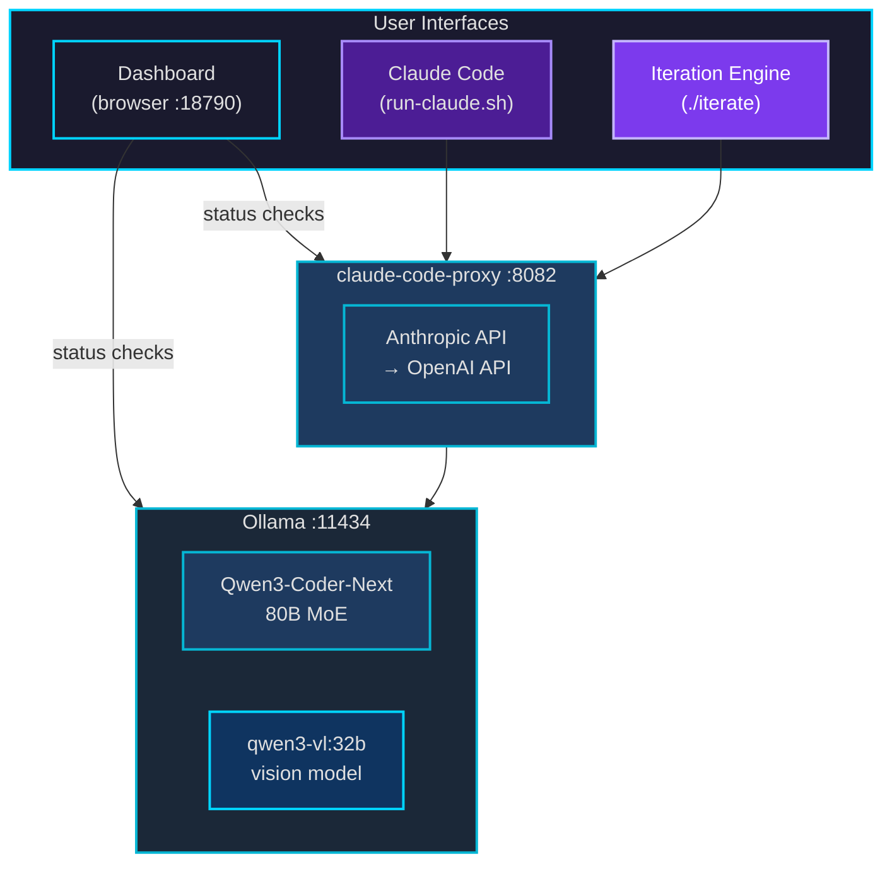
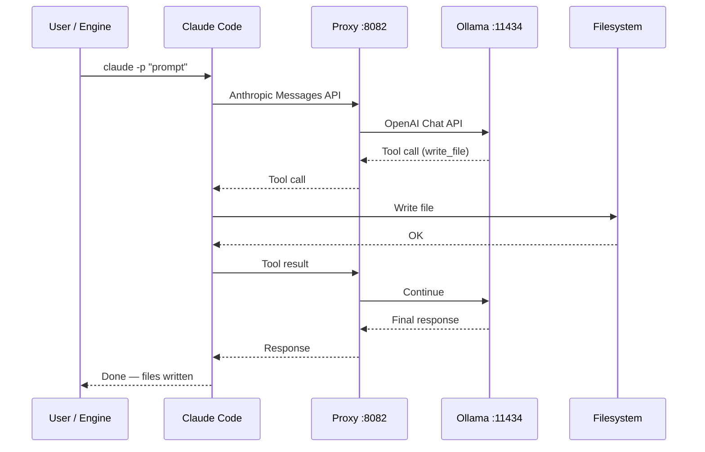
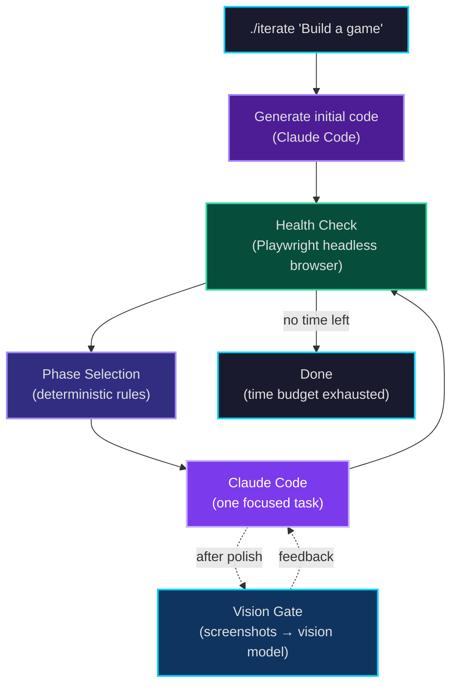
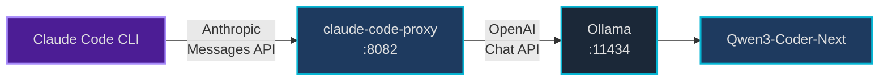
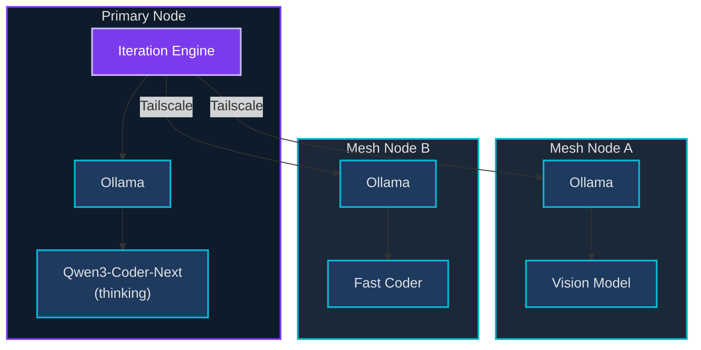
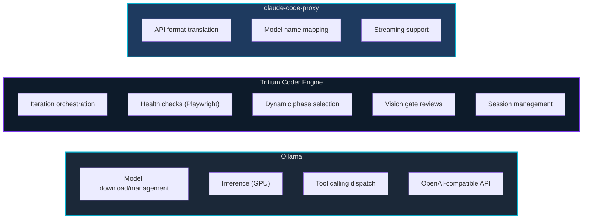

# Architecture

*(c) 2026 Matthew Valancy | Valpatel Software*

## Single Machine

The default setup runs everything on one machine. Two services start and stay resident; you interact through the dashboard or terminal.

## Request Flow

How a coding job flows through the system, from user prompt to generated code.

## Iteration Engine Flow

The perpetual iteration engine (`build-project.sh`) orchestrates the build loop.

## Claude Code Path

Claude Code uses the proxy to translate Anthropic's Messages API to OpenAI's Chat Completions API, which Ollama speaks natively.

## Agent Mesh (Experimental)

Multiple machines on a Tailscale network form a mesh. The primary node runs the main model. Mesh nodes run specialized models and are accessed via Tailscale DNS.

## Component Responsibilities

