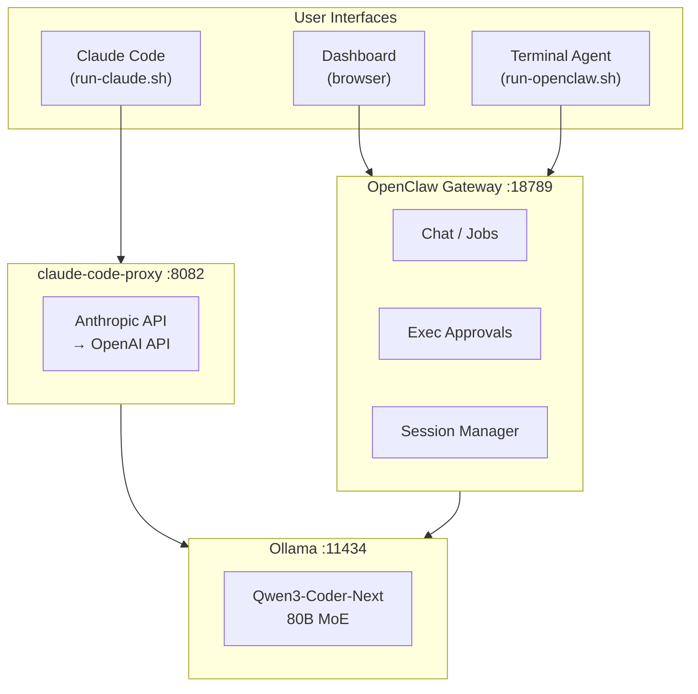
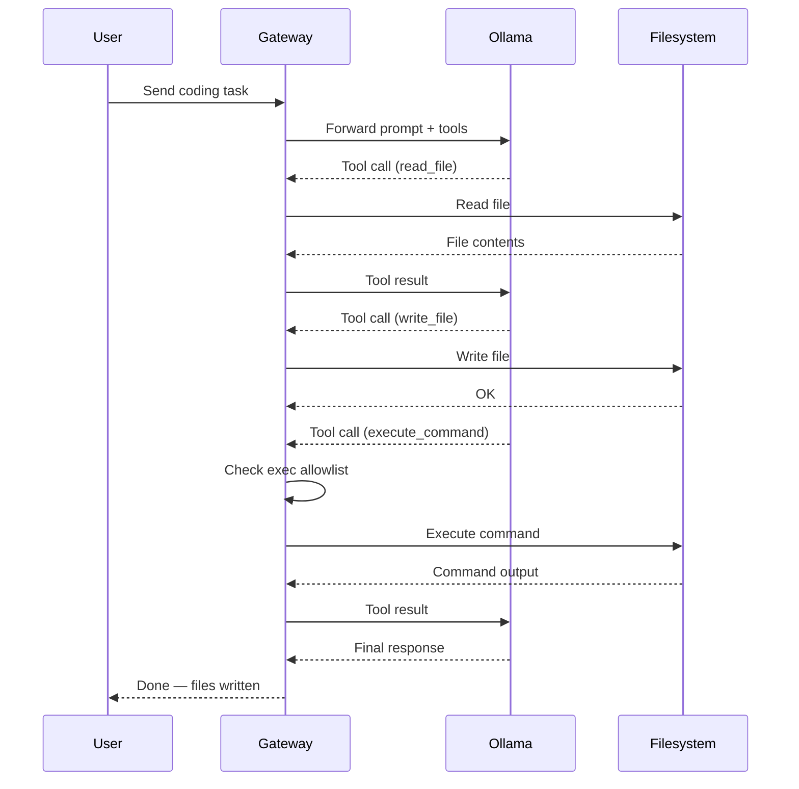
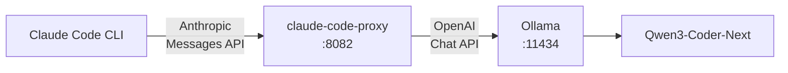
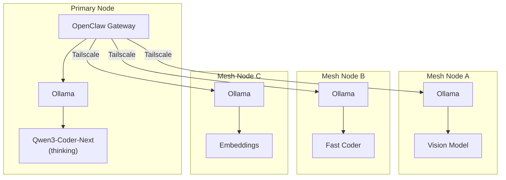
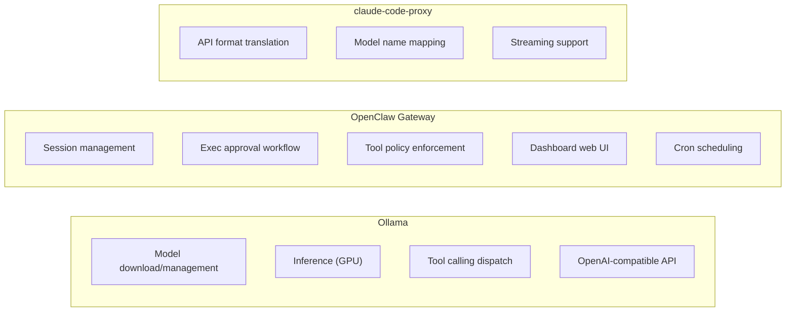

# Architecture

*(c) 2026 Matthew Valancy | Valpatel Software*

## Single Machine

The default setup runs everything on one machine. Three services start and stay resident; you interact through the dashboard or terminal agents.

## Request Flow

How a coding job flows through the system, from user prompt to generated code.

## Claude Code Path

Claude Code uses the proxy to translate Anthropic's Messages API to OpenAI's Chat Completions API, which Ollama speaks natively.

## Agent Mesh

Multiple machines on a Tailscale network form a mesh. The primary node runs the gateway and the main thinking model. Mesh nodes run specialized models and are registered as additional providers.

## Component Responsibilities

