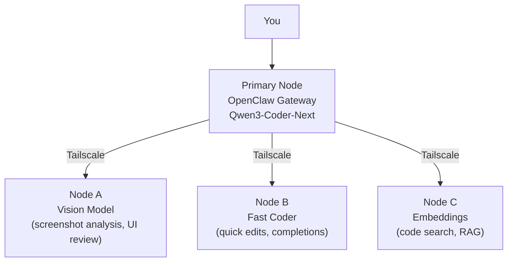
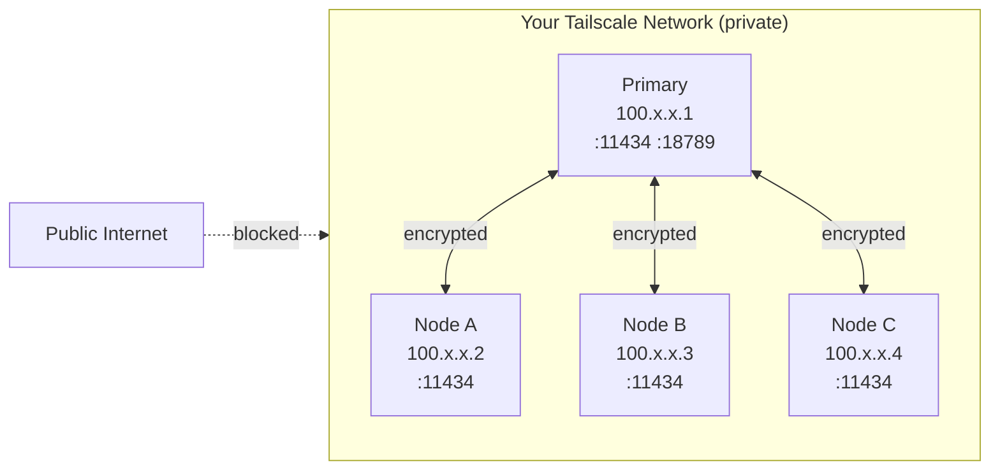

# Agent Mesh Setup

*(c) 2026 Matthew Valancy | Valpatel Software*

Scale Tritium Coder across multiple machines using Tailscale. Each machine runs Ollama with specialized models; the primary node coordinates everything through the OpenClaw gateway.

## Overview



## Hardware Examples

| Role | Model | Hardware | RAM Needed | Purpose |
|------|-------|----------|-----------|---------|
| **Primary thinker** | Qwen3-Coder-Next 80B | GB10 | 128 GB | Planning, complex code, debugging |
| **Fast coder** | Qwen2.5-Coder 7B | Orin AGX / RTX | 16 GB | Quick edits, completions, test generation |
| **Vision** | LLaVA-Next 34B | GB10 / Orin | 32 GB | Screenshot analysis, UI review |
| **Embeddings** | nomic-embed-text | Any CPU | 2 GB | Code search, RAG indexing |

## Setup

### 1. Set up the primary node

Follow the standard install:

```bash
git clone https://github.com/mvalancy/tritium-coder.git
cd tritium-coder
./install.sh
scripts/start.sh
```

### 2. Set up a mesh node

On each additional machine (must be on your Tailscale network):

```bash
# Install Ollama
curl -fsSL https://ollama.com/install.sh | sh

# Pull the model for this node's role
ollama pull qwen2.5-coder:7b    # fast coder
# or: ollama pull llava-next     # vision
# or: ollama pull nomic-embed-text  # embeddings

# Verify it's running
curl http://localhost:11434/api/tags
```

That's it for the mesh node. No other software needed.

### 3. Register the mesh node on the primary

Edit `config/openclaw.json` on the primary node. Add a provider for each mesh node:

```json
{
  "models": {
    "providers": {
      "ollama": {
        "baseUrl": "http://127.0.0.1:11434",
        "api": "ollama",
        "models": [
          {
            "id": "qwen3-coder-next",
            "name": "Qwen3 Coder Next",
            "reasoning": true,
            "input": ["text"],
            "contextWindow": 65536,
            "maxTokens": 32768
          }
        ]
      },
      "fast-coder": {
        "baseUrl": "http://<tailscale-ip-of-node-a>:11434",
        "api": "ollama",
        "models": [
          {
            "id": "qwen2.5-coder:7b",
            "name": "Fast Coder",
            "input": ["text"],
            "contextWindow": 32768,
            "maxTokens": 8192
          }
        ]
      },
      "vision": {
        "baseUrl": "http://<tailscale-ip-of-node-b>:11434",
        "api": "ollama",
        "models": [
          {
            "id": "llava-next",
            "name": "Vision",
            "input": ["text", "image"],
            "contextWindow": 32768,
            "maxTokens": 4096
          }
        ]
      }
    }
  }
}
```

Then apply and restart:

```bash
cp config/openclaw.json ~/.openclaw/openclaw.json
scripts/stop.sh && scripts/start.sh
```

### 4. Verify connectivity

From the primary node, verify each mesh node is reachable:

```bash
# Check each node
curl http://<tailscale-ip>:11434/api/tags

# List available models across all providers
openclaw models list
```

## Network Topology



All traffic between nodes goes over Tailscale's encrypted WireGuard tunnels. No ports are exposed to the public internet.

## Scaling Tips

- **Start small.** One machine is enough for most coding work. Add nodes when you need specialized models.
- **GPU matters more than CPU.** Inference speed is dominated by GPU memory bandwidth.
- **Model size = RAM.** A 7B model needs ~8 GB RAM. A 34B model needs ~24 GB. An 80B MoE model needs ~50 GB.
- **One model per node.** Ollama can serve multiple models, but switching between them flushes GPU memory. Dedicate each node to one role.
- **Tailscale is zero-config.** Once a machine is on your tailnet, it's reachable by IP. No port forwarding, no DNS, no VPN setup.
