# Security Model

*(c) 2026 Matthew Valancy | Valpatel Software*

Tritium Coder is hardened for local coding work. The agent can write code and run commands on your machine, but cannot use elevated permissions, automate browsers, or expose services to the network.

## Security Boundaries

```mermaid
flowchart TB
    subgraph Allowed["Allowed (Green Zone)"]
        style Allowed fill:#1a3a1a
        A1["Read/write local files"]
        A2["Run shell commands"]
        A3["Search the web (read-only)"]
        A4["Fetch documentation"]
        A5["Access localhost services"]
    end

    subgraph Blocked["Blocked (Red Zone)"]
        style Blocked fill:#3a1a1a
        B1["Elevated permissions (sudo)"]
        B2["Browser automation"]
        B3["Remote network access"]
        B4["Cross-context messaging"]
        B5["Agent-to-agent communication"]
    end

    Agent["OpenClaw Agent"] --> Allowed
    Agent -.->|Denied| Blocked
```



## Controls

| Control | Config Key | Setting | Effect |
|---------|-----------|---------|--------|
| **Network binding** | `gateway.bind` | `loopback` | Gateway only on localhost. Not on LAN or internet. |
| **Authentication** | `gateway.auth.mode` | `token` | All requests require auth token. |
| **Shell execution** | `tools.exec.security` | `full` | Agent can run any command. No sudo or elevated permissions. |
| **Filesystem** | `tools.fs.workspaceOnly` | `false` | Agent can read/write anywhere locally. |
| **Browser** | `browser.enabled` | `false` | No Playwright/Chrome automation. |
| **Web access** | `tools.web.search/fetch` | `enabled` | Can search and fetch docs. Read-only. |
| **Elevated** | `tools.elevated.enabled` | `false` | No sudo, no root. |
| **Cross-context** | `tools.message.crossContext` | `false` | Cannot message external services. |
| **Agent-to-agent** | `tools.agentToAgent.enabled` | `false` | Cannot spawn or talk to other agents. |

## Exec Security

The agent runs in **full** exec mode — it can run any shell command without approval prompts. This enables autonomous coding (installing deps, running tests, building projects) without getting blocked.

**Safety guardrails still apply:**
- No sudo or elevated permissions (`elevated.enabled: false`)
- No browser automation (`browser.enabled: false`)
- Runs as normal user — cannot modify system files or install system packages without sudo

To switch to a more restrictive allowlist mode:

```json
"exec": {
  "security": "allowlist",
  "safeBins": ["python3", "node", "git", "ls", "cat", "mkdir"]
}
```

In allowlist mode, commands not on the list trigger an approval prompt in the dashboard.

## Remote Access (Optional)

By default, the gateway is localhost-only. For remote access from your Tailscale network:

```bash
# Enable Tailscale Serve on your tailnet (one-time)
# Visit the link shown by: tailscale serve 18789

# Then:
tailscale serve 18789
```

This gives HTTPS access from any device on your private Tailnet. The gateway is never exposed to the open internet.

## Config Location

| File | Purpose |
|------|---------|
| `config/openclaw.json` | Template (committed to repo) |
| `~/.openclaw/openclaw.json` | Live config (applied on install/run) |

To reset to hardened defaults:
```bash
cp config/openclaw.json ~/.openclaw/openclaw.json
```
