# Security Model

*(c) 2026 Matthew Valancy | Valpatel Software*

Tritium Coder is hardened for local coding work. The agent can write code and run commands on your machine, but cannot use elevated permissions or expose services to the network.

## Security Boundaries

```mermaid
flowchart TB
    subgraph Allowed["Allowed (Green Zone)"]
        style Allowed fill:#1a3a1a
        A1["Read/write local files"]
        A2["Run shell commands"]
        A3["Run headless browser (Playwright)"]
        A4["Access localhost services"]
    end

    subgraph Blocked["Blocked (Red Zone)"]
        style Blocked fill:#3a1a1a
        B1["Elevated permissions (sudo)"]
        B2["Remote network access"]
        B3["Cloud API calls"]
        B4["Data exfiltration"]
    end

    Agent["Claude Code Agent"] --> Allowed
    Agent -.->|Denied| Blocked
```



## How It Works

Claude Code runs with `--dangerously-skip-permissions` so it can autonomously write code, run tests, and build projects without approval prompts. This is intentional — the iteration engine needs to run unattended.

**Safety guardrails:**
- Runs as your normal user — cannot modify system files without sudo
- Talks only to `localhost:8082` (proxy) which talks to `localhost:11434` (Ollama)
- No cloud APIs, no external network calls at runtime
- Ollama is the only service that binds to a network port

## Exec Security

The agent can run any shell command without approval. This enables autonomous coding (installing deps, running tests, building projects) without getting blocked.

**What it CAN do:**
- Read/write files anywhere your user can
- Run `pip install`, `npm install`, `python3`, `node`, `git`, etc.
- Launch headless browsers (Playwright) for health checks
- Access any localhost service

**What it CANNOT do:**
- Run `sudo` or elevated commands
- Access remote servers or APIs
- Send data outside your machine
- Modify system configuration

## Remote Access (Optional)

By default, everything is localhost-only. For remote access from your Tailscale network:

```bash
tailscale serve 18790    # Expose control panel to your tailnet
```

This gives HTTPS access from any device on your private Tailnet. Nothing is exposed to the open internet.

## Future: Native Security Policies

We are building native session management and security policies to replace the external agent framework we started with. The goal:

- **Per-project sandboxing**: restrict file access to the project directory
- **Command allowlists**: configurable per-project exec policies
- **Audit logging**: track every file write and command execution
- **Resource limits**: CPU/memory/time budgets per session
