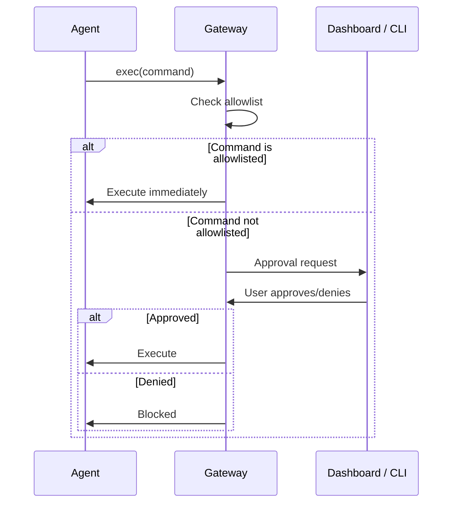

# Security Model

*(c) 2026 Matthew Valancy | Valpatel Software*

Tritium Coder is hardened for local coding work. The agent can write code and run approved commands on your machine, but cannot install software, access the internet autonomously, or expose services to the network.

## Security Boundaries

```mermaid
flowchart TB
    subgraph Allowed["Allowed (Green Zone)"]
        style Allowed fill:#1a3a1a
        A1["Read/write local files"]
        A2["Run allowlisted commands"]
        A3["Search the web (read-only)"]
        A4["Fetch documentation"]
        A5["Access localhost services"]
    end

    subgraph Blocked["Blocked (Red Zone)"]
        style Blocked fill:#3a1a1a
        B1["Install software (apt, pip, npm)"]
        B2["Browser automation"]
        B3["Elevated permissions (sudo)"]
        B4["Remote network access"]
        B5["Cross-context messaging"]
        B6["Agent-to-agent communication"]
    end

    Agent["OpenClaw Agent"] --> Allowed
    Agent -.->|Denied| Blocked
```



## Controls

| Control | Config Key | Setting | Effect |
|---------|-----------|---------|--------|
| **Network binding** | `gateway.bind` | `loopback` | Gateway only on localhost. Not on LAN or internet. |
| **Authentication** | `gateway.auth.mode` | `token` | All requests require auth token. |
| **Shell execution** | `tools.exec.security` | `allowlist` | Only pre-approved commands can run. Everything else is blocked. |
| **Filesystem** | `tools.fs.workspaceOnly` | `false` | Agent can read/write anywhere locally. |
| **Browser** | `browser.enabled` | `false` | No Playwright/Chrome automation. |
| **Web access** | `tools.web.search/fetch` | `enabled` | Can search and fetch docs. Read-only. |
| **Elevated** | `tools.elevated.enabled` | `false` | No sudo, no root. |
| **Cross-context** | `tools.message.crossContext` | `false` | Cannot message external services. |
| **Agent-to-agent** | `tools.agentToAgent.enabled` | `false` | Cannot spawn or talk to other agents. |

## Exec Allowlist

The agent can only run commands you've explicitly approved. Default allowlist:

```
python3, node, npm, git, ls, cat, mkdir
```

Add more commands:
```bash
openclaw approvals allowlist add "pytest"
openclaw approvals allowlist add "docker"
openclaw approvals allowlist add "pip install"
```

View current allowlist:
```bash
openclaw approvals allowlist list
```

## Exec Approval Flow

When the agent tries to run a command not on the allowlist:



## Remote Access (Optional)

By default, the gateway is localhost-only. For remote access from your Tailscale network:

```bash
# Enable Tailscale Serve on your tailnet (one-time)
# Visit the link shown by: tailscale serve 18789

# Then:
tailscale serve 18789
```

This gives HTTPS access from any device on your private Tailnet. The gateway is never exposed to the open internet.

## Config Location

| File | Purpose |
|------|---------|
| `config/openclaw.json` | Template (committed to repo) |
| `~/.openclaw/openclaw.json` | Live config (applied on install/run) |

To reset to hardened defaults:
```bash
cp config/openclaw.json ~/.openclaw/openclaw.json
```
